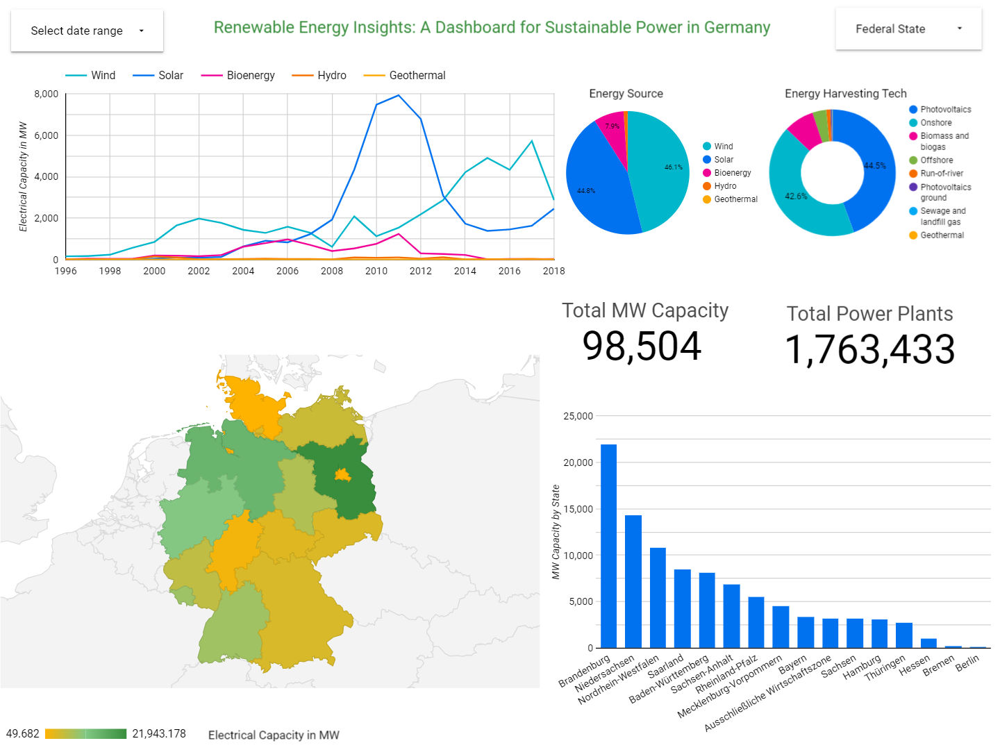

## How to Use

1. Follow the setup instructions provided in the project documentation to set up the required environment and dependencies.
2. Explore the codebase and run the data pipeline to process and analyze the renewable energy data from Germany.
3. Visualize insights from the dataset using the provided dashboard.

# Reproducing EcoEnergy-Germany Project

1. Clone or fork this repository to your local machine.

## Setup GCP project and Service Account

If you do not have, create a GCP project and service account with three main roles:

- roles/storage.Admin: This role grants full administrative access to Cloud Storage buckets, allowing Terraform to create, delete, and modify them.
- roles/bigquery.DataEditor: This role allows creating, updating, and deleting datasets and tables in BigQuery. Terraform requires this role to manage BigQuery resources like creating datasets and tables or deleting them.
- roles/BigQuery Job User: This role allows submitting BigQuery Jobs.

Create a key for the mentioned GCP service account and put the JSON key file inside the secrets directory.

Change values for the following variables in `terraform/terraform.tfvars` according to your GCP project information and service account key JSON file name. Make sure that for the JSON file you only change the file name, not the complete path.

```plaintext
credentials  = "../secrets/your_json_file_name.json"
project_id   = "gcp_project_id"
region       = "gcp_project_region"
bucket_name  = "gcs_bucket_name"
dataset_id   = "bigquery_dataset_name"
table_id     = "bigquery_table_name"
```

## Environment Setup

**Prerequisites:**

- [Terraform](https://developer.hashicorp.com/terraform/install)
- [Docker with Docker-Compose](https://www.docker.com/products/docker-desktop/)

If you do not have them already installed, you can install Terraform using the `install_terraform.sh` script.

```bash
chmod +x install_terraform.sh
./install_terraform.sh
```

To install Docker with Docker-compose, use the following command for Ubuntu.

```bash
sudo snap install docker
```

## Infrastructure Setup

Move to the terraform directory and execute the following commands:

```bash
cd terraform
terraform init
terraform plan
terraform apply
```

When prompted, write 'yes' and press Enter.

Once the infrastructure setup is complete, modify the values of the following variables in `example.env`, rename the file to `.env`, and utilize the values you employed in the terraform.tfvars file. Ensure that you refrain from altering DATASET_URL, and only modify the file name for the JSON file in GCP_CREDENTIALS.

```plaintext
GCP_CREDENTIALS = "/home/src/secrets/your_json_file_name.json"
GCP_PROJECT_ID=gcp_project_id
GCS_BUCKET=gcs_bucket_name
BIGQUERY_DATASET=bigquery_dataset_name
BIGQUERY_TABLE=bigquery_table_name
```

## Create Project Docker Container Image

Move to the root directory of the project where docker and docker-compose.yml files exist and run the following command:

```bash
docker-compose up -d
```

The `-d` parameter is used to run the command in detached mode.

## Run the Project Pipelines

The pipelines are scheduled to run monthly. To run the pipelines once, follow these steps:

Run the command:

```bash
docker exec -it ecoenergy_de /bin/bash
```

Then run the command inside the Docker image terminal. You have to move to the root directory of Mage's root directory, otherwise, it fails to locate the `io_config.yml` file.

```bash
cd /home/src/mage-ecoenergy
```

And then run the following command:

```bash
python run_mage_pipelines.py
```

You can also access Mage using port 6789 (url:6789) of the machine running the project and run the pipeline manually.

The pipeline execution will take time. Once completed, you will have raw and transformed data in cloud storage and BigQuery. Looker Studio's dashboards are not reproducible, but if you want, you can recreate a dashboard like this or a different one.


